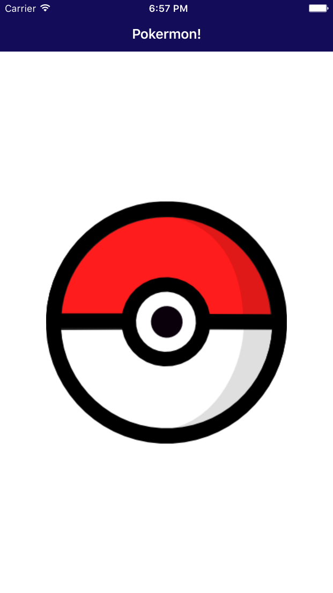
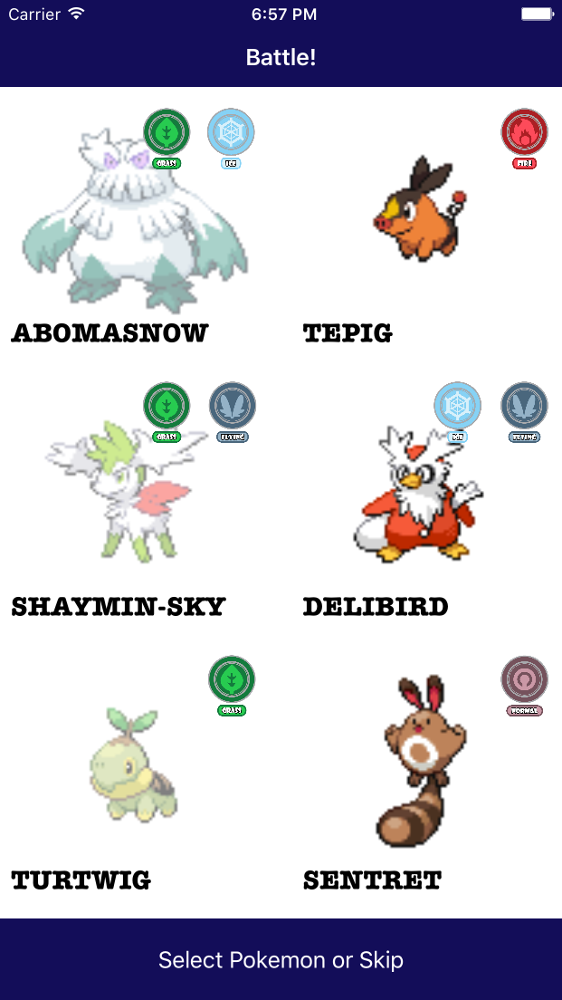
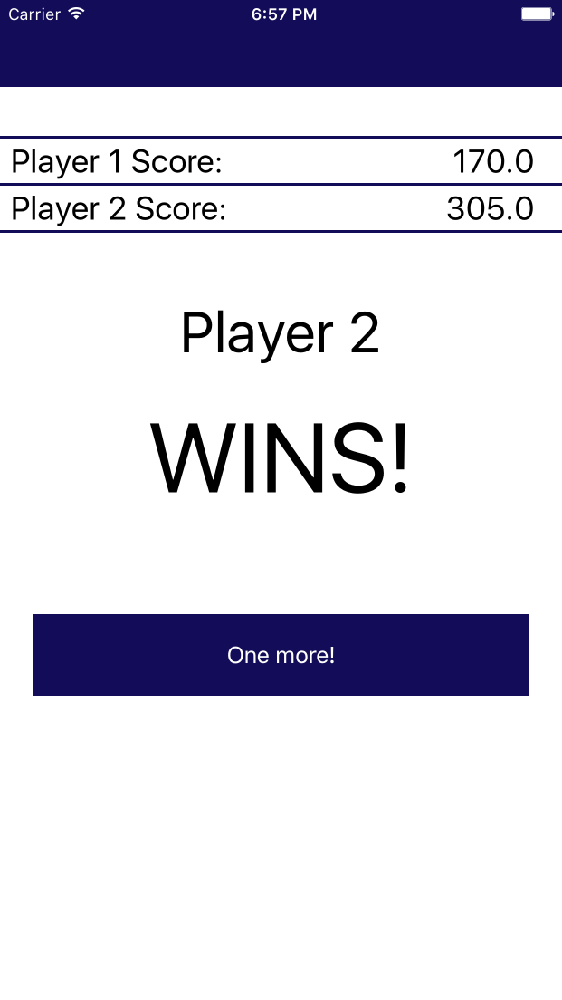

# PokeBattleDemo
Demo using pokeapi

# Installation
This uses XCode 7.3 (Swift 2.2).

# How to use (play)
There is an intial draw of 3 random pokemon per player.  Each player gets 2 rounds to discard one pokemon and get another random one.  After both players have completed all rounds, damage is calculated according to the pokemon types and the damage they can inflict to the opposing player's pokemon.  The winner is the player who can inflict the most damages to other players.  Type effectiveness is calculated according to the rules described in [Bulbapedia](http://bulbapedia.bulbagarden.net/wiki/Type) but instead of using specific moves, we are considering all pokemons have only one move which corresponds to their innate type.

# Design Philosophy

## No Storyboards
We are not using storyboards because we want to instantiate UIViewControllers using constructor [dependency injection](https://medium.com/ios-os-x-development/dependency-injection-in-view-controllers-9fd7d2c77e55#.7gq58pbh4).  This facilitates our screen transition and makes sure that view controllers that require a model object are instantiated with the proper object without having to do additional optional handling.

## Humble Object
The ViewControllers are designed to be as lean as possible, where most of the logic is delegated to other, reusable classes.  Although it is arguable whether this could be called a design pattern or not, we are using the [Humble Object](https://medium.com/ios-os-x-development/humble-object-pattern-in-swift-de5efe8fe05a#.t76op2yj5) philosophy to design this app. 

# Things that are missing (aka TODO)

## Cache integration
Calls to PokeApi are costly, partly because the JSON responses are huge and contain a lot of information we don't need for our applcation.  They even recommend on their [own site](http://pokeapi.co/docsv2/) to use a cache system if we are to do api calls often.  Due to the size and nature of the data, saving to user preferences is discouraged.  It would probably be best to use SQLite and build a simple database for caching the PokeApi requests.

## Automated testing
Integrate with [Travis CI](https://travis-ci.org/) and build automated tests to validate the application.  Because of it's random nature, it might be hard to test with snapshots though.

## Network integration
This game would be best played online but due to time limitations, it has been implemented as (one of the few!) local multiplayer iPhone games.

## Full Swift documentation
Documentation is not using the full extent of the [Swift markup language](https://developer.apple.com/library/ios/documentation/Xcode/Reference/xcode_markup_formatting_ref/).  This is probably OK for an app, but a framework would benefit from it.

## Xamarin
[Xamarin](https://www.xamarin.com/) implementation would have been better, considering we are aiming for iOS/Android cross-platform usage, but the proof of concept has been implemented in iOS/Swift only for now due to time constraints.

## Dependency Injection and mocks
We already have proper dependency injection in our view controllers.  This would make the project easy to mock and test.  What we need to do next is deign proper interfaces for the objects passed to the view controller initializers so that a mock implementation can be passed as well.

## Localization
In iOS, localization is as easy as putting all our strings in localizable .strings files.  This should be relatively trivial to do with our application.

## Home screen

### Progress View
We have 1 task to retrieve the pokemon list and n tasks to retrieve initial draw pokemons from the home screen.  A rudimentary progress view could be implemented instead of the activity indicator to give the user a better indicator of the loading progress.

## BattleScreen

### Collection View
We should be using a collection view instead of hardcoding 3 pokemon per player to make the program more extensible.  In that case, extra pokemon would mean long loading times but there might be a better way to stream data to circumvent this problem.
